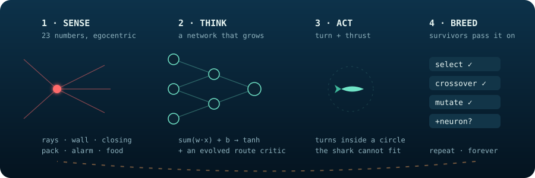
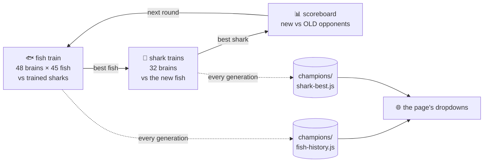
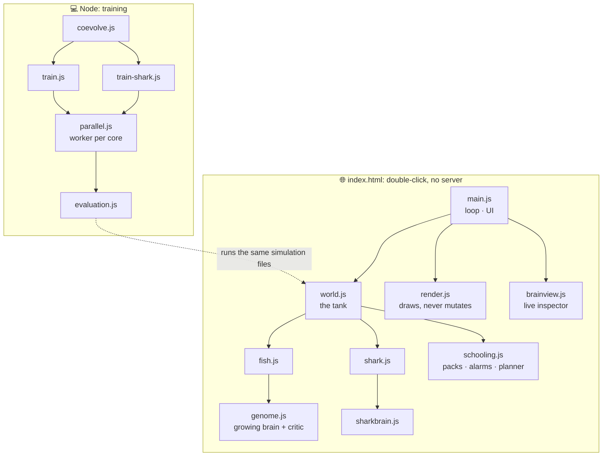

<div align="center">


<a href="https://fishtank-ai.vercel.app/">
  
</a>

<br>

<a href="https://fishtank-ai.vercel.app/"></a>

<br><br>


<br>



<sub>Not a mockup: the real simulation, recorded frame by frame with a trained champion. Regenerate it with <code>node tools/make-demo.js</code></sub>

<br><br>

**[Play it](#-play-it) · [What you're seeing](#-what-youre-seeing) · [How a fish thinks](#-how-a-fish-thinks) · [Controls](#-controls) · [Train it yourself](#-train-it-yourself) · [What it proved](#-what-it-proved) · [Inside the code](#-inside-the-code)**

</div>

---

## ▶ Play it

<table>
<tr>
<td width="50%" valign="top">

### 🌐 In your browser, right now

**[fishtank-ai.vercel.app](https://fishtank-ai.vercel.app/)**

No sign-up, no install. Hover any fish to read its mind; click to pin it.

</td>
<td width="50%" valign="top">

### 💻 On your machine

```bash
git clone https://github.com/Xender007/fishtank-ai
cd fishtank-ai
start index.html     # macOS: open · Linux: xdg-open
```

It's plain `<script>` tags and a canvas, so it opens from `file://` with no server and no build.

</td>
</tr>
</table>

---

## 🐟 What you're seeing

A closed tank. **45 fish, one shark.** The shark is **faster** (105 px/s against 90). The fish can't win a straight race, and every fish in the tank knows it, because evolution has told them.

Their one advantage is a turning circle of **30 px against the shark's 66 px**. Every dodge you watch is that single asymmetry being exploited, and nobody programmed it. The fish started with **16 parameters, no hidden neurons and random weights**, and were eaten until they weren't.

<div align="center">

| | 🐟 fish | 🦈 shark |
|---|:---:|:---:|
| top speed | 90 px/s | **105 px/s** |
| turning circle | **30 px** | 66 px |
| brain | a genome that **grows** (23 senses → turn, thrust) | fixed 8 → 6 → 2 network |
| survival instinct | **starves** after 40 s without food | **starves** after 10 s without a meal |
| learns by | evolution + in-life Hebbian plasticity | evolution |

</div>

### What's in the tank

- **🧠 Two brains, both learning.** Fish and shark each carry a neural network, and **they co-evolve**: the fish train against the trained shark, then the shark trains against the new fish, round after round.
- **🤝 Learned teamwork.** Fish sense their pack, their nearest neighbour, the relayed alarm and their own role, and **their network steers the school**. Packs elect a scout (α) and pass warnings one hop at a time.
- **🧭 A brain that plans.** Under threat each fish imagines ~40 escape routes two seconds ahead. An **evolved critic** inside its genome picks one; it's no longer a hand-written formula.
- **🍃 Hunger.** Energy drains. Green pellets refill it, and a fish that hides forever starves. Safety finally costs something.
- **🔬 A live brain inspector.** Every neuron lights up as it fires. Click one to see the exact arithmetic it just did.
- **🌱 Brains that grow.** NEAT-style: new neurons and connections appear only when they earn their keep, plus **memory loops** and **plasticity**.

---

## 🔁 How a fish thinks

<div align="center">

</div>

One neuron is the whole trick, repeated:

```
   inputs × weights, summed, plus a bias  →  squashed by tanh  →  a number between −1 and 1
   (0.82 × −1.31) + (0.05 × 0.44) + (0.91 × 0.77) + 0.20  =  −0.87   →  tanh  →  −0.70
```

Click any neuron in the page and it prints exactly that line, with this tick's real numbers.

<details>
<summary><b>🔎 The 23 senses a fish receives</b></summary>

<br>

Every number is **egocentric** ("40° off my left shoulder", never map coordinates) and normalised, so one learned reflex works anywhere in the tank.

| # | sense | what it tells the fish |
|---|---|---|
| 0–8 | 9 vision rays over 330° | how close the shark is along each ray |
| 9 | wall ahead | how close the glass is in front |
| 10 | own speed | how fast I'm going |
| 11 | closing | is the shark gaining on me, or falling behind? |
| 12 | pack pull | which way my pack's centre is, weighted by how far |
| 13 | pack far | how far from my pack I've strayed |
| 14 | align | which way my packmates are heading, relative to me |
| 15 | neighbour | where the nearest fish is, weighted by closeness |
| 16 | crowded | how close that nearest fish is |
| 17 | is alpha | am I my pack's scout? |
| 18 | alarm dir | which way the threat I know about is, seen or relayed |
| 19 | alarm | how fresh that warning is |
| 20 | energy | how full I am |
| 21 | food dir | which way the nearest pellet is |
| 22 | food near | how close it is |

Senses 12–22 arrived with **layout v3**. They were *appended*, so older brains are migrated rather than thrown away.

</details>

<details>
<summary><b>🌱 How a brain grows (NEAT, hand-rolled)</b></summary>

<br>

- **Generation 1 is minimal:** every sense wired straight to *turn* and *thrust*. No hidden neurons.
- **Four mutations:** nudge a weight · **add a connection** · **add a neuron** (split a wire) · toggle a gene on or off.
- **Innovation numbers** let two parents' genes line up by shared *history* rather than position, which is what makes crossing two different brains safe.
- **Species** shelter a brand-new neuron while it tunes; judged against the whole population it would die the generation it was born.
- **Memory loops:** a connection can read its source's value from *last tick*, giving the fish a sense of time.
- **Hebbian plasticity:** "neurons that fire together wire together". Evolution picks *which* synapses may change during a fish's life.
- **The route critic:** a small evolved scorer that ranks imagined escape routes. It starts as an exact copy of the old hand formula (bit for bit, tested), and evolution takes it from there.

</details>

<details>
<summary><b>🦈 How the shark thinks</b></summary>

<br>

**8 senses:** angle to nearest fish, closeness, the fish's sideways drift (to aim where it's *going*), angle to the crowd, crowd size, wall ahead, **hunger**, own speed.
**6 hidden neurons → turn and speed.** Slowing down halves its turning circle (66 px → 33 px), a lever the brainless shark never used.

**Survival instinct:** no meal in 10 s and it dies; a replacement arrives 1.5 s later. It trains against the champion fish in the background of the page, and flat out with `node train-shark.js`.

</details>

---

## 🎮 Controls

<table>
<tr>
<td width="50%" valign="top">

**Buttons**

| | |
|---|---|
| **FISH BRAIN** | on / off (off = random drift, no packs) |
| **fish brain generation** | pick any trained or page-trained brain |
| **AUTO-TRAIN** | fish evolve in the page (on by default) |
| **SHARK BRAIN** | on / off (off = the classic brainless chaser) |
| **shark generation** | pick any trained shark |
| **SELF-TRAINING** | the shark learns while you watch |
| **TIMER** | generations, or continuous life with babies |
| save · load · restore | keep a brain as a file or in your browser |

</td>
<td width="50%" valign="top">

**Keys**

| key | does |
|:---:|---|
| `space` | pause |
| `s` | step one tick (while paused) |
| `1` `2` `3` `4` | speed 1× · 5× · 20× · 100× |
| `n` | step the forward pass one layer |
| `t` | teamwork: learned ⇄ written rules |
| `p` | planner: evolved critic ⇄ hand formula |
| `h` | hunger on / off |
| `k` | shark brain on / off |
| `b` | fish brain: network → neuron → drift |
| `e` · `g` | evolution on/off · breed now |
| `v` · `l` | all rays · lineage colours |
| `r` | restart |

</td>
</tr>
</table>

> **Tip:** press `t` or `p` while watching to swap the learned behaviour for the hand-written version *live*, and see what evolution changed.

---

## 🏋️ Train it yourself

Training happens in Node, on **every CPU core**, with no drawing and no frame budget. Everything resumes from the saved champion.

```bash
node coevolve.js --rounds 6        # ⭐ fish and shark take turns to learn
node train.js --gens 30            # fish only, against the newest trained shark
node train-shark.js --gens 40      # shark only, against the page's champion
node tests/run-all.js              # 221 assertions
node tests/v3_benchmark.js 24      # before/after + ablations (read-only)
```



<details>
<summary><b>⚙️ What the fish trainer does each generation</b></summary>

<br>

1. **Score:** each of 48 brains controls a **shoal of 45 copies of itself** (the size the page shows) against **2+ trained sharks**, over 3 trials. A shoal of one brain can't blame anyone else for its losses.
2. **Race:** the top 8 get **9 more trials** before anyone believes them (see *what it proved*).
3. **Climb the ladder:** if the population survives more than 80% of the time, add a shark; below 35%, remove one. Too easy and too hard both stop learning.
4. **Breed:** tournaments within species, crossover by innovation number, mutation, occasionally a new neuron.
5. **Every 5 generations:** a 36-seed held-out benchmark decides what's saved, and a separate page-setting benchmark decides what the page shows.

Scoring runs on a worker-thread pool that gives **identical numbers to the last bit** as a single thread. Measured on a 4-core laptop: **3.0× faster**.

Controls for experiments: `--rules` · `--hand-planner` · `--no-hunger` · `--no-prior` · `--opponent chaser` · `--workers 0`.

</details>

**Co-evolution works.** After one round, on 12 held-out seeds (45 fish, 60 s):

| | fish eaten |
|---|---:|
| starting fish vs starting shark | 17.3 |
| **new fish** vs starting shark | **14.3** ↓ the fish learned |
| starting fish vs **new shark** | **18.8** ↑ the shark learned |

---

## 🧪 What it proved

Every number here was measured, and the scripts that measured them are in `tests/`.

> ### 🎲 A learning curve going up is not evidence of learning
> Sixty copies of **one identical brain** scored with the same spread as sixty *different* brains; selection was reading pure luck. It happened *again* in the harder world: 48 children ranked on two seed sets correlated at **r = 0.04**. The cheapest diagnostic in the whole project is cloning one brain and watching how much its score moves on its own. **Racing** the finalists fixed it.

> ### 📏 A score that saturates cannot teach
> At 30-second generations 56% of fish hit the cap and scored *identically*: 8% learning in 80 generations. At 90 seconds the same code improved **34% in twenty**.

> ### 🔥 Too hard is as bad as too easy
> Three sharks cut survival from 37 s to 11 s and learning collapsed. Hence the difficulty ladder.

> ### 🐠 The schooling never emerged, until the fish could sense each other
> Fish once grouped *more tightly* when they were physically unable to perceive each other, so the pattern wasn't the mechanism. Layout v3 finally gives the network the team as input.

> ### 🧠 A hand-wired neuron lost to a random drunkard
> 125 eaten against 41. That's the argument for *learning* weights instead of choosing them.

---

## 🗂 Inside the code



| file | what lives there |
|---|---|
| `js/genome.js` | Brains that grow: nodes, connections, innovation numbers, memory, plasticity, **the route critic** |
| `js/brain.js` | The neuron. Multiply, sum, add bias, squash; that really is all of it |
| `js/senses.js` | The world reduced to 23 numbers |
| `js/schooling.js` | Packs, scouts, alarm relay, social senses, escape-route search |
| `js/evolution.js` | Fitness, tournament selection, crossover, speciation |
| `js/sharkbrain.js` · `js/sharktrainer.js` | The shark's brain, and its self-training |
| `js/world.js` | The tank: physics, food, eating, starvation. Never draws |
| `js/render.js` · `js/brainview.js` | Everything you see. Never changes the simulation |
| `js/config.js` | **Every tunable number**, most with the measurement that chose it |
| `coevolve.js` · `train.js` · `train-shark.js` | The trainers |
| `parallel.js` · `evaluation.js` | Multi-core scoring, bit-identical to single-thread |
| `tests/` | 18 suites, 221 assertions, plus read-only benchmarks |

<details>
<summary><b>🧱 Design rules the code keeps</b></summary>

<br>

- **The simulation never draws; the renderer never mutates.** That's what makes 100× fast-forward and headless training possible.
- **Fixed timestep, integer tick counter.** `1/60` summed 1800 times is `29.999999999999996`, and a 30 s generation would never end.
- **One seeded RNG for the simulation, separate ones for decoration and food.** A seed reproduces a run exactly.
- **The measuring stick is preserved.** Tests run with the written rules, brainless shark and no hunger, so every number in [`PLAN.md`](PLAN.md) stays comparable across stages.
- **No build step, no modules.** Browsers block `import` on `file://`, and this project opens with a double-click.

</details>

---

## 📚 Read further

- **[`PLAN.md`](PLAN.md)**: the full build log, stage by stage, with every measurement and every prediction that turned out wrong
- **[`HANDOFF.md`](HANDOFF.md)**: orientation for picking it up cold: invariants, findings not worth re-deriving, open problems
- **[`js/config.js`](js/config.js)**: worth reading on its own

<div align="center">

<br>

<a href="https://fishtank-ai.vercel.app/"></a>

<br><br>

<sub>MIT licensed · built with <a href="https://claude.com/claude-code">Claude Code</a> · UI pass with <a href="https://github.com/nextlevelbuilder/ui-ux-pro-max-skill">ui-ux-pro-max</a> (not vendored)</sub>


</div>
